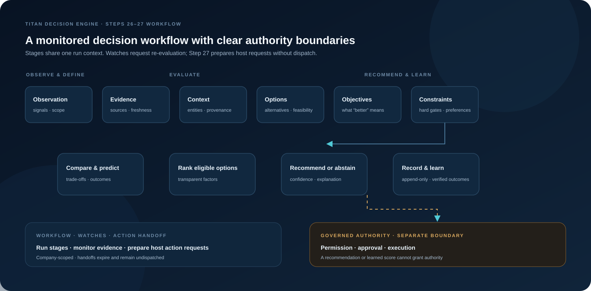

<p align="center">
  
</p>

<h1 align="center">Titan Decision Engine</h1>

<p align="center"><strong>Decision intelligence you can inspect, challenge, and govern.</strong></p>

<p align="center"><a href="https://github.com/Masterleeaus/decision-engine/actions/workflows/authority-gate-eval.yml"></a></p>

<p align="center">
  A domain-neutral architecture for turning evidence into constraint-aware recommendations—with uncertainty, provenance, and authority boundaries made explicit.
</p>

<p align="center">
  <a href="#architecture">Architecture</a> ·
  <a href="#capabilities">Capabilities</a> ·
  <a href="#trust-boundaries">Trust boundaries</a> ·
  <a href="#reproducible-authority-handoff-evaluation">Authority eval</a> ·
  <a href="#implementation-status">Implementation status</a>
</p>

---

## Make the path to a decision visible

A single score can hide missing evidence, policy limits, competing objectives, or fragile assumptions. Titan separates those concerns into explicit stages so a reviewer can see what is known, what remains uncertain, which options are eligible, why one leads, and what approval is still required.

**Titan Decision Engine** is a modular decision-support layer for AI-assisted and human-reviewed systems. It is designed for business, operational, workforce, environmental, financial, procurement, scheduling, and other decision domains.

> **Decision model:** subject + objectives + options + evidence + constraints + preferences → predicted outcomes and trade-offs → ranking → recommendation + confidence + authority requirements.

The engine can analyze and recommend. It does not authorize or execute the recommendation.

## Run it

Node.js 22.6 or newer is required.

```bash
npm ci
npm test
npm run eval
npm run validate:math
npm run example:environment
```

`npm test` builds the package entry point and all 21 engine projects, then runs the 16 compiled TypeScript suites and five JavaScript suites. `npm run build` builds without running tests. `npm run coverage` runs the same tests through c8. The package exposes the engines through named namespaces at its root and stable subpath exports.

## Architecture

<p align="center">
  
</p>

The repository preserves a 25-step research bundle and extends its TypeScript reference engines through Step 30. The public source tree contains the canonical decision model and packet contract, Steps 10–25, workflow coordination, watch lifecycle management, event-to-watch signal routing, capability-gated action handoff, and provider reliability telemetry.

| Decision stage | Steps | Responsibility |
|---|---:|---|
| **Observe and ground** | 10–13 | Capture system or browser context, establish evidence, normalize entity references, and gather contextual facts with source and freshness metadata. |
| **Frame the choice** | 14–17 | Discover alternatives, state what success means, evaluate constraints, and apply scoped preferences. |
| **Compare and rank** | 18–20 | Compare unlike options, preserve missing data and trade-offs, attach provider-supplied forecasts, and calculate transparent rankings with sensitivity scenarios. |
| **Recommend and explain** | 21–23 | Recommend or abstain against configured thresholds, explain the result from explicit inputs, and apply observed-outcome confidence calibration. |
| **Preserve and learn** | 24–25 | Create hash-bound decision-history revisions and derive future calibration updates from verified outcomes. |
| **Orchestrate, manage watches, route, hand off, and monitor** | 26–30 | Coordinate ordered stages, manage watch lifecycle, route validated source changes to matching watches, request evidence-backed re-evaluation, prepare expiring host requests, and measure provider reliability. |

Steps 08 and 09 define the shared meaning and transport format for the pipeline:

- The **Canonical Decision Model** describes the subject, objectives, options, evidence, constraints, preferences, predictions, trade-offs, ranking, recommendation, confidence, and authority prerequisites.
- The versioned **DecisionPacket** carries those concepts between systems. Domain-specific fields belong in `extension_data`; they cannot redefine the canonical company boundary or authority rules.

## What makes the architecture different

### Hard requirements stay hard

Eligibility is decided before soft preferences and weighted scores. A hard constraint failure cannot be compensated for by a strong score elsewhere. Unknown hard requirements block eligibility by default, while soft violations remain visible as penalties.

### “Do nothing” and “not enough information” are valid outcomes

The canonical model can represent investigation, deferral, escalation, approval requests, and other non-action choices. The Best-Action Engine can abstain when there is no eligible candidate or configured confidence, coverage, or leader-margin thresholds are not met.

### Evidence and uncertainty travel with the result

Source references, timestamps, freshness, confidence, assumptions, missing measurements, and conflicts can remain explicit. A low-coverage comparison does not silently become complete, and forecast records carry their model, horizon, assumptions, and evidence references.

### A reviewer can see why the ranking changed

Rankings expose dimension-level contributions and support objective- and dimension-weight sensitivity scenarios. The explanation stage can show why an alternative leads, why others scored lower, which evidence mattered, what is uncertain, and what changes could move the result.

### Learning produces revisions; it does not rewrite the past

Decision history uses snapshots, hashes, and supersession links. The learning loop requires a verified outcome and verification references, then emits new forecast, assumption, recommendation, and confidence calibration statistics. Historical snapshots remain unchanged.

### Recommendation is separate from authority

The engine can describe prerequisites for action, but it does not create identity, permission, entitlement, ownership, approval, financial authority, or execution authority. A host system must apply its own governance before acting.

## Capabilities

| Step | Engine | Capability |
|---:|---|---|
| **10** | Observation | Accepts browser or system context, emits rule-based observations and candidate signals, and labels browser content as untrusted input. |
| **11** | Evidence extraction | Represents raw or derived evidence with source, timestamp, confidence, freshness, and optional derivation metadata. |
| **12** | Entity normalization | Groups source records within one `company_id` using strong identifiers and retains source-record references and evidence links. |
| **13** | Context enrichment | Collects facts from pluggable providers with source class, confidence, freshness, and per-provider receipts. |
| **14** | Option discovery | Collects and deduplicates candidate actions, resources, suppliers, assignments, interventions, schedules, strategies, tools, and resolutions while preserving provenance and feasibility state. |
| **15** | Objective model | Makes objective scope, direction, priority, weights, hardness, time horizon, thresholds, provenance, and conflicts explicit. |
| **16** | Constraint engine | Evaluates permission, budget, deadline, availability, jurisdiction, policy, environment, safety, privacy, capability, entitlement, and company-boundary constraints. |
| **17** | Preference model | Applies time-scoped company or actor preferences to trade-offs while rejecting authority-like preferences. |
| **18** | Comparison | Compares options across cost, time, quality, risk, benefit, sustainability, reversibility, confidence, reliability, and strategic value; reports coverage, pairwise trade-offs, and a descriptive Pareto frontier. |
| **19** | Outcome prediction | Validates and packages provider-supplied forecasts with horizons, bounds, confidence, assumptions, and evidence references. |
| **20** | Ranking | Produces decomposable scores, factor contributions, exclusions, confidence adjustments, and weight-sensitivity scenarios. |
| **21** | Best action | Selects a recommendation candidate or abstains based on candidate availability and configurable confidence, coverage, and margin thresholds. |
| **22** | Explanation | Produces structured evidence-linked reasons, lower-ranked alternatives, uncertainties, and sensitivity context; it does not include hidden chain-of-thought. |
| **23** | Confidence | Applies scoped calibration profiles based on observed-outcome bins, with raw confidence retained separately. |
| **24** | Decision history | Creates snapshot-hashed revisions and verifies supersession chains without editing earlier snapshots. |
| **25** | Learning loop | Uses verified outcomes to calculate forecast error, assumption reliability, recommendation performance, and confidence calibration updates. |
| **26** | Decision workflow | Composes Steps 10–25, emits hash-linked stage events, checks company scope, applies a fail-closed constraint gate, evaluates watches, and accepts learning updates only after external outcome verification. |
| **27** | Action handoff | Prepares an expiring, idempotent request only for a constraint-eligible recommendation and a fresh host capability assessment (five-minute default, configurable from one to 60 minutes); approvals and dispatch remain with the host. |
| **28** | Provider reliability | Captures privacy-minimized provider outcomes, latency, freshness summaries, and reliability snapshots; health is diagnostic only. |
| **29** | Decision signal router | Maps host-validated field-change signals to active watches within the exact company and decision-subject scope; returns event-cycle requests without queueing or evaluating them. |
| **30** | Watch lifecycle | Plans watch creation, definition changes, pause, resume, and soft close with revision and event contracts; host authorization, listing, and atomic persistence remain external. |

## Domain-neutral by design

The DecisionPacket contract includes profiles and examples for:

- Operations
- Finance
- Workforce
- Environment
- CRM
- Assets
- Procurement
- Marketing
- Scheduling
- Other domains

A domain supplies its own entities, evidence, objectives, alternatives, and constraints. The shared packet keeps cross-domain semantics consistent while `extension_data` carries typed domain-specific detail.

## Trust boundaries

- **One company scope:** `company_id` is the canonical company boundary. The decision model does not create parallel tenant authority fields.
- **No authority transfer:** observations, evidence, provider facts, preferences, predictions, rankings, and learning updates carry no execution authority.
- **Fail closed on unknown hard constraints:** unresolved hard requirements remain visible and block eligibility by default.
- **Untrusted browser inputs:** page content can contribute evidence, but it cannot become policy or permission.
- **No hidden reasoning transcript:** explanations are generated from structured factors, evidence references, assumptions, uncertainty, and sensitivity data.
- **Governed execution stays external:** the calling product remains responsible for identity, authorization, approvals, risk, cost, privacy, receipts, and audit.
- **Provider health is diagnostic:** operational telemetry does not change recommendation ranking, confidence, constraint eligibility, authorization, or routing.

These are decision-support boundaries. They do not replace authentication, authorization, policy enforcement, or a governed execution service in the integrating application.

## Reproducible authority handoff evaluation

**Claim tested:** Step 27 prepares a ready handoff only when the recommendation is constraint-eligible, the action binding matches, and the host capability assessment is fresh, available, and authorized. Assessment freshness defaults to five minutes and can be configured from one to 60 minutes. Requests remain undispatched; the host retains approval, persistence, revalidation, and execution.

Run from the repository root:

```bash
npm run eval
```

The runner combines 20 curated cases with 240 deterministic generated cases, using fixed as-of time 2026-10-04T00:00:00.000Z and seed 20261004. Generated cases cover valid requests, stale and expired assessments, idempotent replays, mismatched bindings, and cross-company inputs. The report includes 95% Wilson intervals and every scenario's expected and actual result. CI builds and tests all 21 engine projects, runs the eval and math checks, and uploads the reports.

**Measured 4 October 2026** against commit [2e7118b](https://github.com/Masterleeaus/decision-engine/commit/2e7118bb0baca84231ebe15ef3a072b8e6eb6e4a); scenario SHA-256: `503400974efd077f75cf85edfc27363c1b9971443917826edcf881b5739cb25f`. The current JSON and Markdown reports are linked below.

| Measure | Result | 95% Wilson interval |
| --- | ---: | ---: |
| Unsafe ready handoffs on blocked or unresolved cases | 0 / 177 | 0.0%–2.1% |
| Valid recommendations wrongly blocked | 0 / 83 | 0.0%–4.4% |
| Wrong-company attempts producing a request | 0 / 42 | 0.0%–8.4% |
| Dispatch-contract violations | 0 / 260 | 0.0%–1.5% |
| Recommendation-only baseline unsafe dispatches | 175 / 177 | 96.0%–99.7% |
| Idempotent replays retaining the same key | 40 / 40 | 91.2%–100.0% |

The baseline is a deliberately simple rule that would dispatch any non-empty recommendation while ignoring constraints and host authorization. It is a no-gate comparator, not a competing product. The approval-required case returns a request for the host approval flow; it remains undispatched and is not counted as a ready handoff. These intervals describe this synthetic test set; they are not estimates of real-world production failure rates.

Single-call timings are recorded in the JSON report for context only; they are not an incremental latency comparison. This evaluation tests the Step 27 reference function, not a deployed host's storage, approval, or dispatch integration. See the current [JSON report](eval-results/authority-gate-latest.json) and [Markdown summary](eval-results/authority-gate-latest.md).

### Optional live LLM proposal run

The repository's 200-case runner sends synthetic user requests to an OpenAI Responses API model. It keeps company scope, option eligibility, action binding, capability state, and authorization under host control, then evaluates each model proposal with Step 27 and counts prepared and approval-required handoffs. A prepared request remains undispatched. The existing workflow also runs an offline smoke check without an API request.

```bash
node --experimental-strip-types scripts/llm-authority-gate-eval.mjs --offline
OPENAI_API_KEY="$OPENAI_API_KEY" OPENAI_MODEL="your-enabled-model" node --experimental-strip-types scripts/llm-authority-gate-eval.mjs
```

Set the repository variable `RUN_LLM_EVAL=true`, secret `OPENAI_API_KEY`, and variable `OPENAI_MODEL` to opt into the live run from the main CI workflow. The separate LLM workflow also supports manual `workflow_dispatch`. No live model result is claimed until a live run executes. Reports are written to `eval-results/llm-authority-gate-live.json`; offline reports use `eval-results/llm-authority-gate-offline.json`.

### Math checks

`npm run validate:math` fits confidence bins on 60,000 seeded simulated outcomes and evaluates them on a separate 40,000 outcomes. It reports Brier score and expected calibration error before and after calibration. It also compares this engine's ranking with a reference TOPSIS implementation on a seven-option synthetic fixture. The comparison reports agreement; it does not treat either method as universally correct. See [the math report](eval-results/math-validation-latest.md).

### Worked environmental example

`npm run example:environment` compares excavation, in-situ bioremediation, chemical oxidation, and monitored attenuation. It applies a hard 270-day window, ranks eligible options, creates a DecisionPacket, and prints the structured explanation. All example measurements, costs, and estimates are synthetic and are not field data or remediation advice.

## Integration pattern

Steps 26–30 provide reference workflow, watch lifecycle, signal routing, monitoring, and action-handoff layers for a host application:

1. Adapt source systems into observations, evidence, canonical entities, and context.
2. Supply domain-specific providers for options and forecasts.
3. Provide objectives, constraints, and scoped preferences for the decision subject.
4. Run the ordered workflow; its constraint gate stops on missing, unknown, or ineligible hard requirements before scoring.
5. Use Step 30 to create, update, pause, resume, or close a watch. The host authorizes each command and atomically persists its revision and lifecycle event; watch-list queries remain host store operations.
6. For event-driven reevaluation, map authenticated source changes to canonical field paths and pass the host-validated signal and scoped watch candidates to Step 29. A host worker invokes Step 26 for each returned event-cycle request.
7. Keep scheduled watch checks in the host scheduler and use Step 26 to evaluate each due watch.
8. Pass the resulting DecisionPacket to the host product, where its governance decides whether a recommended action may proceed.
9. When action preparation is useful, call Step 27 with the eligible recommendation, host option-to-capability binding, and fresh host assessment; the host handles approval, rechecks authority, and dispatches.
10. Wrap provider calls with Step 28 to collect privacy-minimized reliability observations; the host stores them and defines alerting or routing policy.
The coordinator sequences injected stage adapters. Durable storage, cross-run idempotency, providers, scheduling, notifications, and governed execution remain host responsibilities.

## Implementation status

This repository is a **research-backed architecture package with modular TypeScript reference engines, decision workflow coordination, event-to-watch routing, action handoff, and provider reliability telemetry**. It is not yet a turnkey deployed service or a single installable SDK.

**Included**

- Canonical Decision Model and versioned DecisionPacket contract
- JSON Schema Draft 2020-12 definitions
- TypeScript runtime modules for Steps 10–30
- Step 26 workflow coordination, evidence-backed watch evaluation, and verified-outcome gating
- Step 27 capability-gated action request preparation without approval or dispatch
- Step 28 provider call capture and reliability aggregation without vendor telemetry
- Step 29 event-to-watch routing for host-validated normalized signals
- Step 30 revision-checked watch lifecycle planning and minimized transition events
- Per-stage contracts, validators, tests, examples, and acceptance artifacts where provided
- Architecture assets and the original cumulative Step 25 research bundle

**Host-application work still required**

- Publishing and maintaining the public SDK release
- Durable history, learning, watch, and provider-telemetry storage; cross-run idempotency; operational alerting; and a production scheduler
- Production adapters for business systems and forecasting providers
- Authentication, authorization, approval, and governed execution integrations

Steps 26–30 are reference composition, lifecycle, routing, and monitoring layers; they do not provide production connectors, durable watch listing or storage, command receipt retention, atomic persistence, cross-run queue deduplication, workflow/action/telemetry stores, a scheduler, approval service, alert delivery, or action execution. Per-engine acceptance artifacts remain as development records; executable TypeScript and JavaScript suites are the source of truth for current behavior. Some early step documents refer to the pre-convergence Python implementation; the [convergence notes](docs/development/README-TYPESCRIPT-CONVERGENCE.md) describe the current TypeScript direction.

## Repository guide

| Path | What to find |
|---|---|
| [`docs/specification/08-canonical-decision-model/`](docs/specification/08-canonical-decision-model/) | Shared decision semantics, schema, example, and field matrix |
| [`docs/specification/09-decisionpacket-contract/`](docs/specification/09-decisionpacket-contract/) | Versioned packet contract, JSON Schema, domain profiles, and ten example packets |
| [`engines/10-observation-engine/`](engines/10-observation-engine/) – [`engines/30-watch-lifecycle/`](engines/30-watch-lifecycle/) | TypeScript reference engines, workflow coordination, watch lifecycle, signal routing, action handoff, provider reliability telemetry, contracts, schemas, tests, and examples |
| [`docs/archive-integration/REUSABLE-PATTERN-COVERAGE.md`](docs/archive-integration/REUSABLE-PATTERN-COVERAGE.md) | Deep-scan mapping from archive patterns to engine capabilities and host boundaries |
| [`docs/archive-integration/CAPABILITY-COVERAGE.csv`](docs/archive-integration/CAPABILITY-COVERAGE.csv) | Row-by-row disposition of all 44 archive-observed capabilities |
| [`docs/development/README-TYPESCRIPT-CONVERGENCE.md`](docs/development/README-TYPESCRIPT-CONVERGENCE.md) | Current runtime-language and convergence notes |
| [`archive/Titan Decision Engine Master Step 25.zip`](archive/Titan%20Decision%20Engine%20Master%20Step%2025.zip) | Original cumulative research and implementation bundle |
| [`docs/DEEP-SCAN-PROMPT.md`](docs/DEEP-SCAN-PROMPT.md) | Reusable repository-audit prompt |

## Explore the model

- [Canonical Decision Model](docs/specification/08-canonical-decision-model/README-STEP-08-CANONICAL-DECISION-MODEL.md)
- [DecisionPacket contract](docs/specification/09-decisionpacket-contract/README-STEP-09-DECISIONPACKET-CONTRACT.md)
- [DecisionPacket examples](docs/specification/09-decisionpacket-contract/examples/)
- [TypeScript convergence notes](docs/development/README-TYPESCRIPT-CONVERGENCE.md)
- [Step 25 Learning Loop](engines/25-learning-loop/README-STEP-25.md)

---

**Titan Decision Engine is the decision-intelligence layer of the Titan architecture:** it makes reasoning inspectable and recommendations explainable while leaving real-world authority with the systems designed to govern action.
